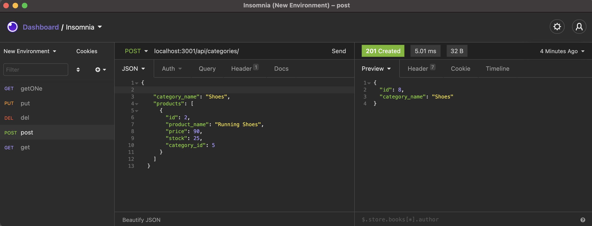

# eCommerceBackend

## Description
This application allows users to compete in ecommerce world.

## Table of Contents
1. [Description](#description)
2. [Deplayed App](#deployed-app)
4. [Contribution Guidelines](#contribution-guidelines)
5. [License Information](#license-information)
6. [Questions](#questions)

## Description
A webapp for managing the back end of an ecommerce site.
## Deployed App
(insert heroku)
[Video](https://youtu.be/_p8Sv7wtxLA)

## Technologies 
* JSON
* Express.js
* Node.js
* mysql12

## Contribution Guidelines
fortega328

## License Information
### MIT

## Questions
For comments and questions fortega328@gmail.com.

Github: https://github.com/fortega328/eCommerceBackend